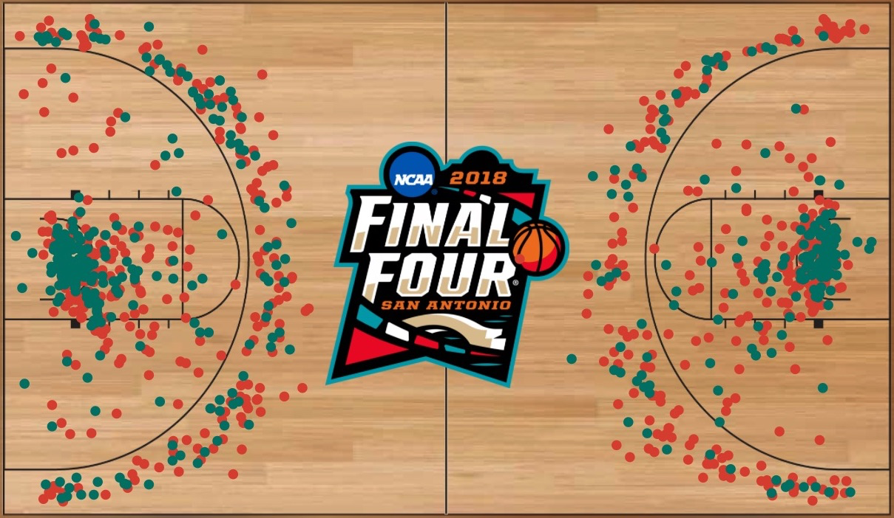

<!-- Hero / branding -->
<p align="center">
  <a href="https://console.cloud.google.com/marketplace/product/ncaa-bb-public/ncaa-basketball">
    
  </a>
  <br>
  <sup><em>Image: NCAA Basketball — Google Cloud Public Datasets.</em></sup>
</p>

# Home Court Advantage in NCAA Basketball: The Unintended Consequence of Rule Changes

**Quick links:** [One-page summary](SUMMARY.md) • [Slides (PDF)](presentation/case_study_presentation.pdf) • [SQL folder](sql/README.md) • [Visuals (PNGs)](visuals/)

## What This Is
A comprehensive analysis examining how NCAA rule changes in 2015-16 coincided with unexpected shifts in home court advantage across Division I men's basketball.

## The Discovery

While NCAA rule changes successfully sped up college basketball (30-second shot clock, restricted arc expansion, timeout reductions), they came with an unintended consequence: **home court advantage quietly eroded by approximately 23%** outside the major conferences.

## Key Findings

- **National Decline**: Home-Road Edge (HRE) dropped from ~16 points to ~12 points (2014-15 to 2016-17)
- **Delayed Effect**: Advantage remained stable during rule implementation year (2015-16), then declined sharply in 2016-17
- **Tier-Specific Impact**: 
  - **Power Six conferences**: Advantage actually increased slightly (12.2 → 13.6 points)
  - **Mid-majors & Other D-I**: Significant erosion (12.8 → 10.2 and 18.0 → 12.5 points respectively)
- **Variance Compression**: Games tightened overall (fewer blowouts), making each point of margin more valuable

## The Detective Work

Systematic investigation ruled out traditional explanations:
- **Officiating**: Free throw rates and foul differentials unchanged
- **Shooting**: Home shooting advantages remained constant (~3-4pp on 2-pointers)
- **Effort Metrics**: Turnover and rebounding edges held steady
- **Pace**: Home tempo advantage actually increased slightly

**The Mechanism**: Road teams caught up offensively. While both home and away scoring increased post-rule changes, road teams gained more (+9.3 ppg vs +6.1 ppg), narrowing the traditional gap.

## Methodology

- **Scope**: 2014-17 Division I men's basketball (3-season window: pre/during/post rule changes)
- **Data**: ~5,500 games per season, 351 team-seasons annually
- **Exclusions**: Tournament games, neutral sites
- **Normalization**: Team-season level analysis (≥8 home & ≥8 road games)
- **Robustness**: Multiple analytical approaches (season pulse, paired swaps, conference-only cuts)

## Why this window (2014–2017)?

- **One clean “shock.”** I scoped around the 2015–16 rules bundle to get a clear **before / during / after** read without mixing eras.  
- **Cuts confounders.** A 5–10 year window pulls in style cycles, realignment, coaching changes, and schedule mix—diluting the signal.  
- **Hypothesis first.** I chose the window **before** analysis by scanning NCAA rule changes and picking the biggest policy shift—question-led, not data-mined.

**What this is (and isn’t):** a **descriptive nowcast** of what moved alongside the 2015–16 changes; **not** a causal proof. Broader validation is outlined in **What’s Next**.

## Data source

- **Dataset:** `bigquery-public-data.ncaa_basketball` (Google Cloud Public Datasets)
- **Table used:** `mbb_games_sr` (men’s D-I game logs)
- **Marketplace:** https://console.cloud.google.com/marketplace/product/ncaa-bb-public/ncaa-basketball
- **Fields relied on (core):** `season`, `scheduled_date`, `h_/a_ id`, `h_/a_ name`, `h_/a_ points`,
  `h_/a_ FGA/FGM`, `h_/a_ FTA`, `h_/a_ 3PA/3PM`, `h_/a_ turnovers`, `h_/a_ rebounds`
- **Filters used:** seasons **2014–2016** (labels: **2014–15, 2015–16, 2016–17**); regular season only; **exclude** tournaments & neutral sites
- **Notes:** `neutral_site` mostly NULL in 2014–15 and 2015–16 → treated NULL as non-neutral (sensitivity checked)
- **Accessed:** Aug 2025

> Data hosted by Google Cloud Public Datasets; see Marketplace page for terms/attribution.

## Business Applications

### Modeling & Predictions
- Reduce default home court parameters nationally
- Implement tier-specific adjustments (Power Six vs others)
- Monitor free throw and foul gaps as early indicators

### Strategic Insights
- Home advantage more fragile in faster-paced environments
- Elite programs with superior resources maintain venue effects
- Traditional "cushion" effects diminished outside major conferences

## Technical Implementation

**Primary metric**: Home–Road Edge (HRE) = avg home margin − avg road margin  
**Venue effect**: ≈ HRE ÷ 2 (classical interpretation)  

**Win probability (quick rule)**: Each point changes win chance by about **0.4 ÷ σ**,  
where **σ** = season standard deviation of final margins.  
- Examples: σ≈23.3 → ~**1.7% per point**; σ≈17.4 → ~**2.3% per point**.  
- Implication here: a ~1.9-point venue change ≈ **3–4.5 pp** in win probability (depending on σ).

**Why this works:** Final margins are roughly bell-shaped (normal).  
- For the **standard normal curve** (mean 0, SD 1), the **probability density at 0** is about **0.4**.  
- For any season with spread **σ** (the standard deviation of final margins), the curve is a stretched version, so the **height at 0 ≈ 0.4/σ**.  

**Therefore:** Near a 50/50 game, each 1-point change shifts win probability by about **0.4/σ**.

**Key Insight**: Environmental advantages don't automatically survive structural changes. Even when individual performance metrics remain stable, overall competitive dynamics can shift due to systemic factors.

## Repository Structure

```
/sql/           # all queries (setup, season pulse, team HRE, channels, tiers, swaps)
/presentation/  # final deck (PDF)
/docs/          # short notes (observations + working)
/visuals/       # chart-only PNGs exported from the deck (2× from Canva)
/README.md      # this file
/SUMMARY.md     # 1-page recap
```

## What's Next

- **Validation**: Extend analysis to additional seasons
- **Deep Dive**: Shot profiles, possession types, officiating patterns
- **Ground Truth**: Film analysis to connect data insights to game reality
- **Operational**: Real-time monitoring dashboard for ongoing trends

---

*This analysis demonstrates how rule changes designed to improve game flow had unintended consequences on competitive balance, providing actionable insights for sports analytics, modeling, and strategic decision-making.*
